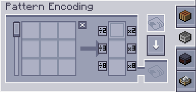

---
navigation:
  parent: expandedae-index.md
  title: Expanded Encoding Terminal
  icon: exp_encoding_terminal
  position: 7
categories:
  - expandedae
item_ids:
- expandedae:exp_encoding_terminal
- expandedae:wireless_exp_encoding_terminal
---

<GameScene zoom="4" background="transparent">
  <ImportStructure src="structures/exp_encoding.snbt" />
  <IsometricCamera yaw="195" pitch="30" />
</GameScene>

## The Expanded Pattern Encoding Terminal is an upgrade to the original terminal adding the following features
 - Shift clicking when encoding a pattern moves it to your inventory
 - In-terminal multiplication buttons 

